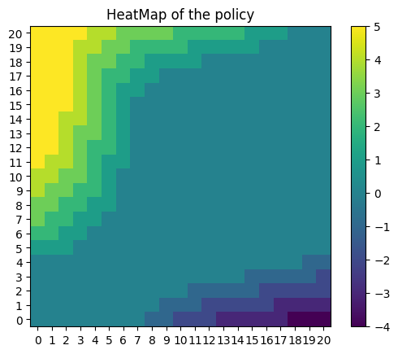
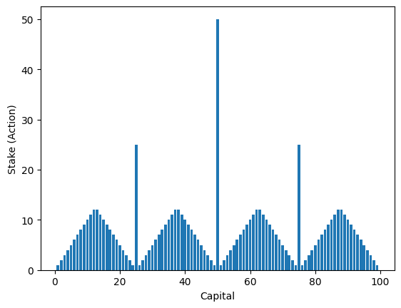

# Week 3
## Reading Material

- Sutton & Barto - Chapter 4

## Videos
You can refer to these videos if required 

[You can go through this lecture](https://www.youtube.com/watch?v=_j6pvGEchWU) by David Silver on Policy Iteration

[You can also go through the rest of that video](https://www.youtube.com/watch?v=_j6pvGEchWU) that was linked last week.

## Part 1 - Renting Cars

The problem statement of part 1 is to implement the Jack's Car Rental Problem as described in Sutton and Barto on page 81 (Example 4.2)

For this part, you should train a RL agent to solve this problem using POLICY ITERATION and display the policy as a heatmap

## Part 2 - Gambling Time

The problem statement of part 2 is to implement the Gambler's Problem as described in Sutton and Barto on page 84 (Example 4.3)

For this part, you should train the RL agent to solve this problem using VALUE ITERATION and display the policy as a bar graph

Also make sure to reason through this answer and understand why it makes sense 

## Part 3 - Solving Lights out

Remember that MDP you made for Lights Out last week? Well let's use RL to solve it! You can use either Policy Iteration or Value Iteration. Just find the optimal policy.

Once you have the policy try to see if you can figure out using this policy what is the minimum number of moves required to guarantee that any initial possible board can be solved (i.e. if we play optimally we will need atleast this many moves to guarantee that you can find the goal state)